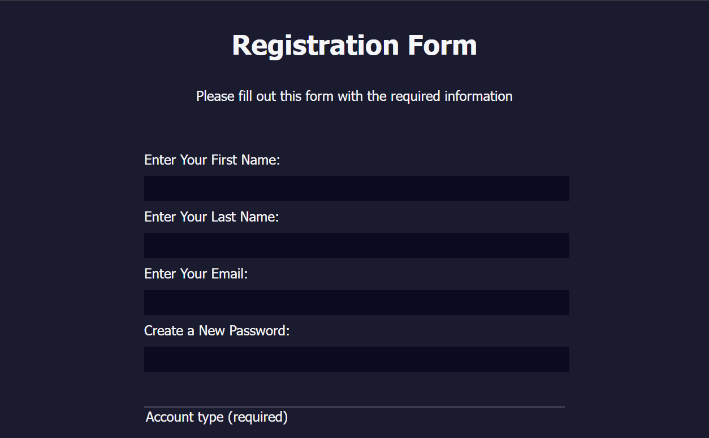

# registration-form

A simple webpage that emulates a registration form.

**Live Demo:** [https://oendemann.github.io/registration-form/]

---

---

## About The Webpage

A project that is a result from a freeCodeCamp guided course on creating a registration form and the inputs that come with said form using CSS and HTML.

---

## Built With

* **HTML:** Used for the structure and format of the form (e.g. fieldsets, links, etc.).
* **CSS:** Used for form styling (e.g. page color, fieldset colors, text color, etc).

---

## What I Learned

1. When creating fieldsets for input, like in a registration form, it is good practice to link the input and label.
2. Specific attributes can be targeted when styling a webpage.

---

## Acknowledgments

* Project idea and requirements from [freeCodeCamp.org]
(https://www.freecodecamp.org/)